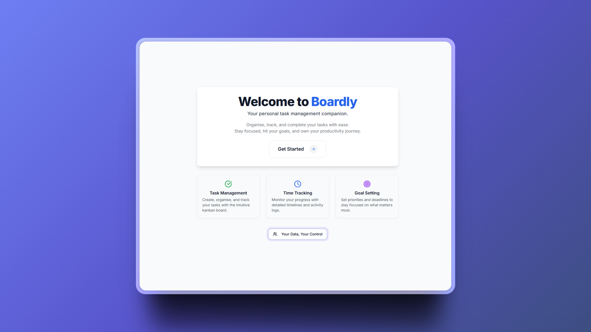
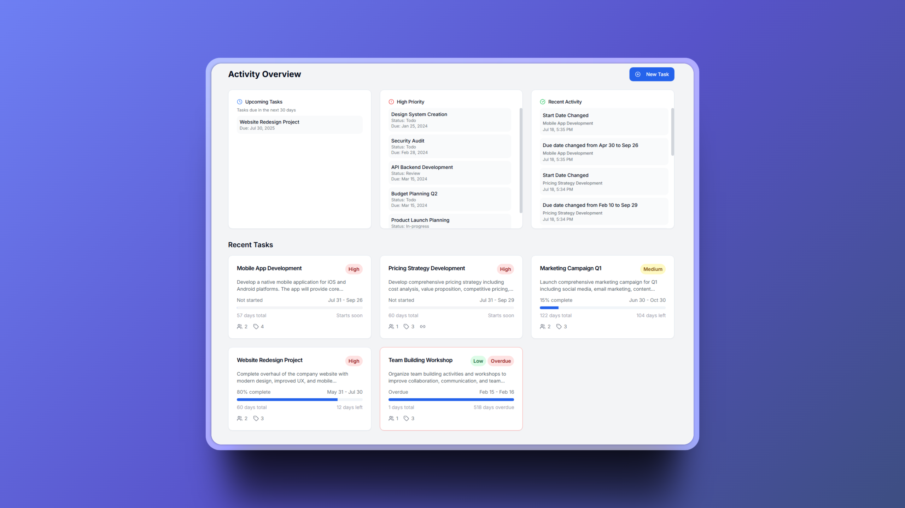
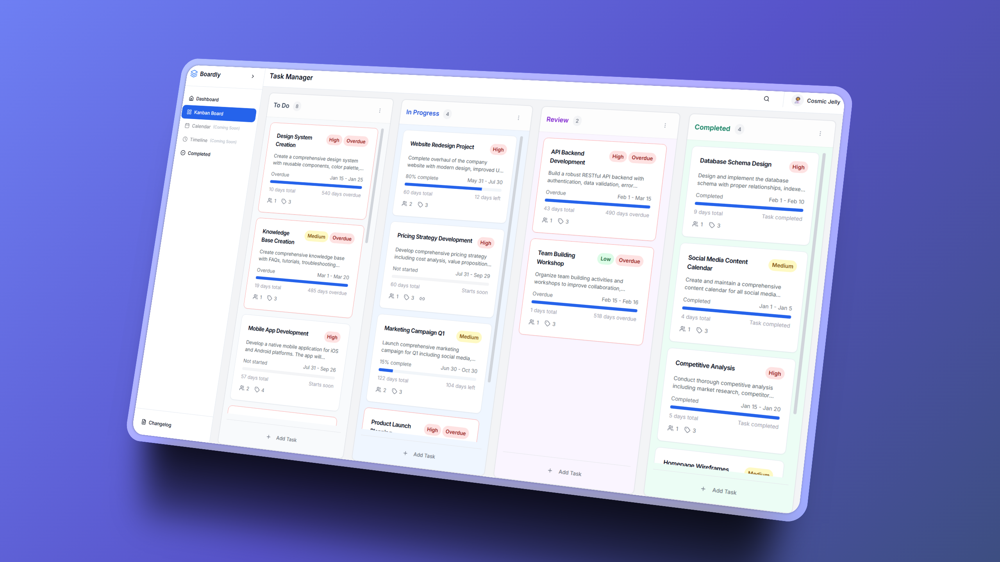
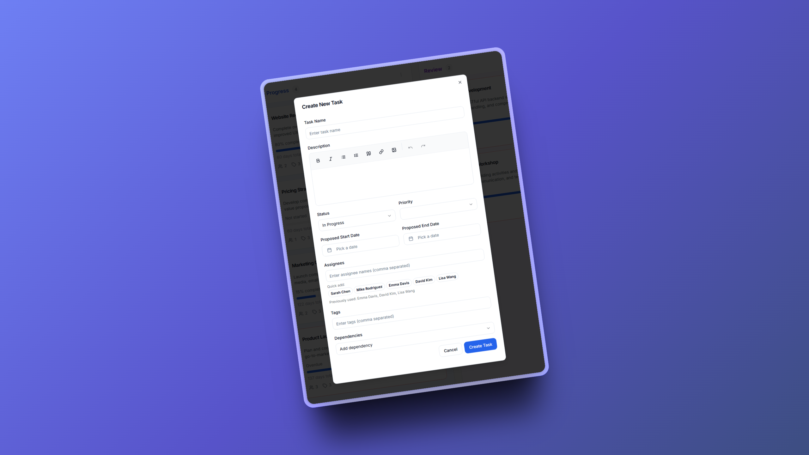
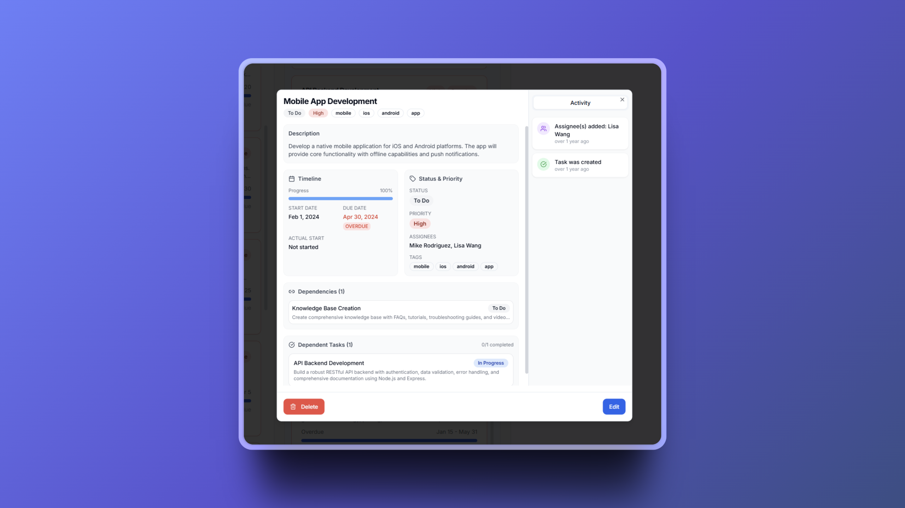

# Boardly - Your Personal Task Management Companion

<div align="center">

### 🚧 **ACTIVE DEVELOPMENT** 🚧

**This project is currently in active development. New features are being added regularly.**

</div>


---

A clean, intuitive task management app that helps you organise, track, and complete your tasks with ease. Built with Next.js, TypeScript, and Tailwind CSS.



## ✨ Features

### 🎯 **Task Management**
- Create and organise tasks with an intuitive kanban board
- Set priorities, due dates, and assignees
- Rich text descriptions 
- Task dependencies and hierarchical relationships

### 📊 **Activity Overview**
- Real-time dashboard with upcoming tasks
- High priority task tracking
- Recent activity logs
- Progress visualisation

### 📋 **Kanban Board**
- Visual progress tracking
- Quick status updates
- Easy to view and navigate
- Add tasks easily
- Drag & Drop features

### 🎨 **Modern Interface**
- Clean, responsive design
- Smooth animations and transitions

_dark mode coming soon_

### 🔒 **Privacy First**
- No accounts or sign-ups required
- All data stays on your device
- No cloud storage or tracking
- Complete control over your information

### 📤 **Data Import/Export**
- Export your tasks and data to JSON files
- Import data from other devices or backups
- Share task lists with whoever
- Backup your progress before clearing browser data

_You can see how data importing works by downloading the example file_\
**[⬇️ Download Example Import File](public/dummy-import.json)**


## 🚀 Getting Started

You've got two options to get Boardly up and running:

### Option 1: Use the Hosted Version (Recommended)
The easiest way to get started - just visit the live demo and start organising your tasks straight away!

**[🚀 Boardly Hosted](https://boardly-inky.vercel.app/)**

Your data stays local to your browser, so you get all the privacy benefits without any setup hassle.

**Privacy Note:** The hosted version is purely for convenience - it still doesn't collect, store, or transmit any of your data. Everything stays in your browser's local storage, just like the self-hosted version.

### Option 2: Self-Host

If you prefer to run it locally or deploy your own instance:

#### Prerequisites
- Node.js 18+ 
- npm, yarn, or pnpm

#### Installation

1. **Clone the repository**
   ```bash
   git clone https://github.com/cosmic-jellyfish/boardly.git
   cd boardly
   ```

2. **Install dependencies**
   ```bash
   npm install
   # or
   yarn install
   # or
   pnpm install
   ```

3. **Run the development server**
   ```bash
   npm run dev
   # or
   yarn dev
   # or
   pnpm dev
   ```

4. **Open your browser**
   Navigate to [http://localhost:3000](http://localhost:3000) to start using Boardly.

## 📸 Screenshots

### Activity Overview
The Activity Overview shows you at a glance Projects that have high priority, upcoming due dates, recent activity and more.



### Kanban Board
The Kanban Board view helps you organise and track tasks. Quickly edit task details, and get a clear visual overview of your project's progress.



### Creating Tasks
Click the "New Task" button to create your first task. Add a title, description, set priorities, and assign due dates.



### Task Details
Click on any task to view and edit detailed information, including descriptions, activity log, dependencies etc 



## 🛠️ Tech Stack

- **Framework**: Next.js 
- **Language**: TypeScript
- **Styling**: Tailwind CSS
- **State Management**: Local storage with custom stores
- **Icons**: Lucide React


## 🤝 Contributing

Contributions are welcome! Here's how you can help:

1. Fork the repository
2. Create a feature branch (`git checkout -b feature/amazing-feature`)
3. Commit your changes (`git commit -m 'Add amazing feature'`)
4. Push to the branch (`git push origin feature/amazing-feature`)
5. Open a Pull Request

_I appreciate any and all help of course!_

## 📄 License

This project is licensed under the MIT License - see the [LICENSE](LICENSE) file for details.


## 🤷‍♂️ Why Not a Full SaaS?

Look, I'm not gonna lie - I'm way too dumb to build a proper SaaS with databases, authentication, user management, and all that jazz. I can barely get my life in order, let alone handle user sessions and data persistence across servers. That's way too much responsibility.

Sometimes the simple solution is the best solution. Plus, you get all the benefits without having to pay.

Win-win! 🎉 


---

<div align="center">

**Made with ❤️**

<a href="https://www.buymeacoffee.com/cosmicjellyfish" target="_blank"></a>

</div>
